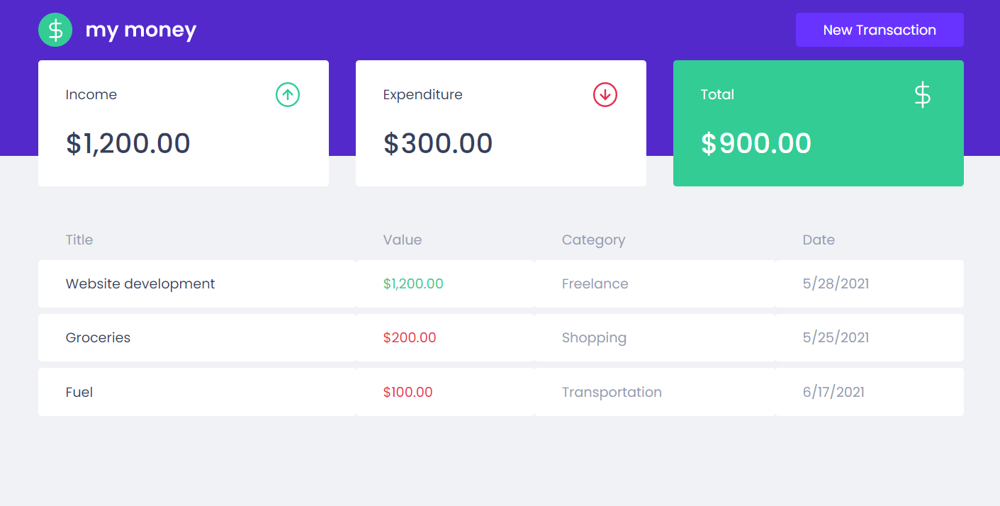
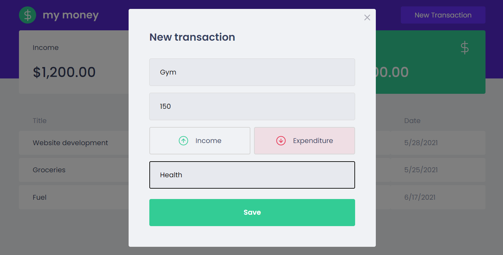
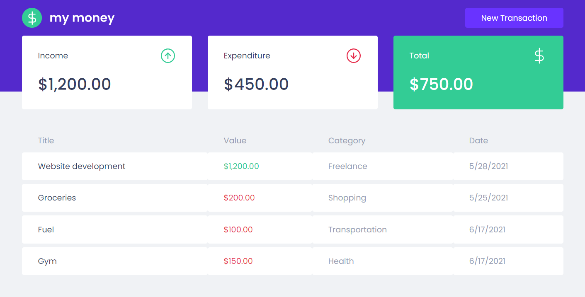
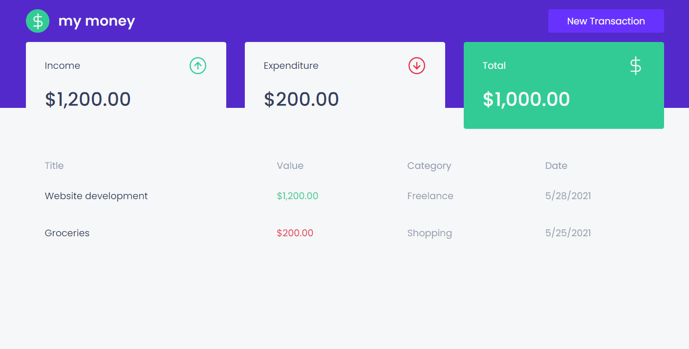

My Money is a web app written in TypeScript / React that allow
you to keep track of your income and expenditures. It uses
[Mirage](https://miragejs.com/) to mock the API, so we
can focus on developing the front-end, even if the API is not
ready.

It's a simple app to showcase my abilities with the React stack.

### Running the project

Clone the project:
```shell
git clone https://github.com/viniciuspjardim/mymoney.git
```

Install it's dependencies:
```shell
yarn
```

Run the project:
```shell
yarn start
```

### Gallery

> Click to enlarge image.

Home page:  


Adding an expenditure:  


The values are updated:  


The full process (the colors are messed up because the GIF limitations):  

